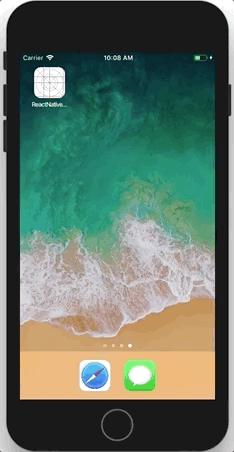
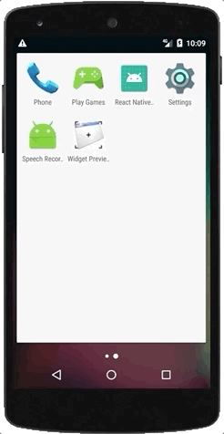

# react-native-vanilla
Most fundamental setup of react native project with Swift and Kotlin support

| iOS        | Android | tvOS |
| ------------- |:-------------:| :-------------:|
|       |   |   |


## Notable Features:

#### iOS
- Latest swift based Xcode project
- Cocoapods Workspace ready
- Swift 4.1 Support

#### Android
- Latest Android project
- Kotlin Support
- Support for Gradle 4.4
- Support for Android JSC (improved support for JavascriptCore like ES6 syntax)

#### iOS
- Latest swift based Xcode project
- Cocoapods Workspace ready
- Swift 4.1 Support


## Requirements
- [Node](https://nodejs.org) `6.x` or newer
- [NPM](https://npmjs.com/) `4.0.0` or newer
- [Cocoapods](https://cocoapods.org) `1.4.x` or newer
- [React Native](http://facebook.github.io/react-native/docs/getting-started.html) for development
- [Xcode](https://developer.apple.com/xcode/) for iOS development
- [Android Studio](https://developer.android.com/studio/index.html) for Android development
- [Android SDK](https://developer.android.com/sdk/) `23.0.1` or newer for Android development

## Stack / Libraries
- [React Native](https://facebook.github.io/react/) `16.4.1` react library
- [React Native](https://facebook.github.io/react-native/) `0.56.0` for building native apps using react
- [Babel](http://babeljs.io/) `7.x.x` for ES6+ support


## Get Started


#### 1. Installation

On the command prompt run the following commands

```sh
$ git clone git@github.com:pavjacko/react-native-vanilla.git

$ cd react-native-vanilla

$ npm run setup
```
#### 2. Run
```
npm start

//iOS
npm run ios

//Android (make sure you have 1 android device connected or 1 emulator running)
npm run android

//tvOS
npm run ios
```
